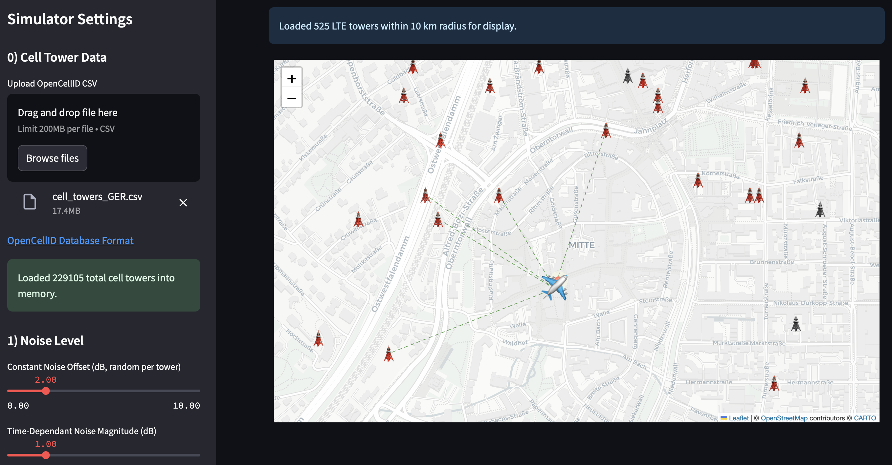

# Cellular Localization Drone Simulator

This is a web-based simulator built with Streamlit that visualizes cellular-based drone localization. It allows you to simulate a drone's flight, its reception of signals from real-world cell towers (loaded from OpenCellID data), and its estimation of its own position using a simplified trilateration/fingerprinting approach, complete with configurable noise and attenuation.

## Features

* **Satellite Map:** Interactive map displaying real cell tower locations (requires OpenCellID CSV data).
* **Drone Simulation:** Move the drone by clicking anywhere on the map.
* **Signal Reception Simulation:** The drone "receives" signals from nearby cell towers, including their Cell ID, LAC, MCC, MNC, and simulated RSSI (Received Signal Strength Indicator).
* **Signal Strength Visualization:** Connected towers are linked to the drone by thin green dotted lines. The RSSI (both in dBm and as a 0-100% bar) is displayed in a list below the map.
* **Position Estimation:** A built-in trilateration/fingerprinting algorithm estimates the drone's position based on received signal strengths. The estimated position is shown as a red dot on the map, along with the localization error.
* **Configurable Settings:**
    * **OpenCellID CSV Upload:** Load your own cell tower data.
    * **Noise Level:** Adjust constant (per-tower random) and time-dependent (sinusoidal) noise in RSSI readings.
    * **Overall Attenuation:** Control the general signal loss, affecting cell tower reach.
    * **Inoperative Towers:** Simulate a percentage of cell towers being out of service.
* **Detailed Connected Tower Info:** A table listing all connected towers and their simulated signal characteristics.

## Getting Started

Follow these instructions to set up and run the simulator on your local machine.

### Prerequisites

* Python 3.7+

### 1. Create a Virtual Environment (Recommended)

It's highly recommended to use a virtual environment to manage project dependencies.

```bash
# Navigate to your project directory
cd your_project_folder

# Create a virtual environment
python -m venv venv

# Activate the virtual environment
# On Windows:
.\venv\Scripts\activate
# On macOS/Linux:
source venv/bin/activate
```

### 2.  Install Dependencies

With your virtual environment activated, install the required Python packages:

```bash
pip install -r requirements.txt

```

### 3. Obtain OpenCellID Data (Optional but Recommended)

For a realistic simulation, you'll want to use real cell tower data.

1.  Go to the  [OpenCellID Downloads Page](https://www.opencellid.org/downloads).
2.  You might need to create a free account to access the full database downloads.
3.  Download a  `.csv.gz`  file for your region of interest.
4.  Extract the  `.csv`  file from the  `.gz`  archive.

The simulator expects the CSV to follow the  [OpenCellID Database Format](https://wiki.opencellid.org/wiki/Database_format). The key columns used are  `lat`,  `lon`,  `cell`,  `mcc`,  `net`,  `area`, and  `radio`.

### 4. Run the Simulator

With your virtual environment activated and dependencies installed, run the Streamlit application:

Bash

```bash
streamlit run 4g_drone_localization_sim.py

```

This command will open the simulator in your default web browser (usually at  `http://localhost:8501`).


## How to Use

1.  **Upload Cell Tower Data:**  In the left sidebar, use the "Upload OpenCellID CSV" button to load your downloaded  `_cells.csv`  file. If you don't upload, a small set of example LTE towers will be used.
2.  **Configure Settings:**  Use the sliders and input fields in the left sidebar to adjust:
    -   **Noise Level:**  Add random and time-dependent variations to simulated signal strength.
    -   **Overall Attenuation:**  Simulate environmental signal loss.
    -   **Inoperative Towers:**  Set a percentage of towers to be non-functional.
    -   **Set Drone Location:**  Manually type in Latitude and Longitude to precisely position the drone.
3.  **Trigger Calculation:**  After changing any sidebar parameters, click the  **"Update Calculation"**  button at the bottom of the sidebar to apply the new settings and refresh the map.
4.  **Move the Drone:**
    -   Click anywhere on the map to instantly move the drone to that new location. This will automatically trigger a recalculation of signals and position.
    -   Changing the Latitude/Longitude in the sidebar will also move the drone and trigger a recalculation.
5.  **Observe Results:**
    -   **Map:**  See the drone, cell towers (LTE only, within 10km), green dotted lines for connections, the red estimated position, and the yellow error circle.
    -   **Localization Error:**  The error in meters is displayed on the map next to the drone and in a text field below the map.
    -   **Connected Cell Towers Table:**  View detailed information about each connected tower and its simulated RSSI.

## OpenCellID Data License

The OpenCellID database, from which this simulator can utilize data,  is licensed under a **Creative Commons Attribution-ShareAlike 4.0 International License (CC BY-SA 4.0)**.

This means you are free to:

-   **Share** — copy and redistribute the material in any medium or format for any purpose, even commercially.
-   **Adapt** — remix, transform, and build upon the material for any purpose, even commercially.

Under the following terms:

-   **Attribution** — You must give appropriate credit, provide a link to the license, and indicate if changes were made. You may do so in any reasonable manner, but not in any way that suggests the licensor  endorses you or your use.
-   **ShareAlike** — If you remix, transform, or build upon the material, you must distribute your contributions under the same license as the original.
-   **No additional restrictions** — You may not apply legal terms or technological measures that legally restrict others from doing anything the license permits.

For more details, please visit  the official OpenCellID website and its  [Licensing page](https://wiki.opencellid.org/wiki/Licensing:).

## Project Structure

-   `4g_drone_localization_sim.py`: The main Streamlit application code.
-   `requirements.txt`: Lists all Python dependencies.
-   `.gitignore`: Specifies files and directories to be ignored by Git.
-   `README.md`: This documentation.

## Customization

-   **Icons:**  Change  `CELL_TOWER_ICON_PATH`  and  `DRONE_ICON_PATH`  in  `4g_drone_localization_sim.py`  to use different image URLs for the icons.
-   **RSSI Model:**  The  `calculate_rssi`  function uses a very simplified propagation model. For more realistic simulations, you could implement more advanced radio propagation models (e.g., Okumura-Hata).
-   **Localization Algorithm:**  Enhance the  `estimate_drone_position`  function with more sophisticated algorithms like a Kalman Filter, Particle Filter, or machine learning-based fingerprinting for improved accuracy and robustness.

## Contributing

Feel free to fork this repository, open issues, or submit pull requests if you have ideas for improvements or encounter bugs.

## License

This project is open-source and available under the MIT License